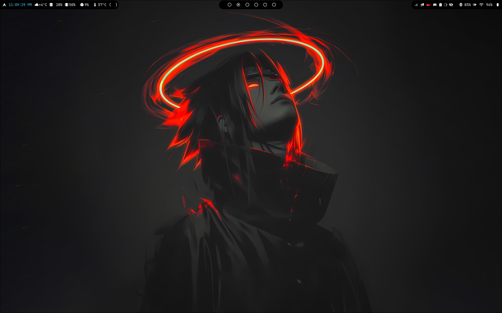
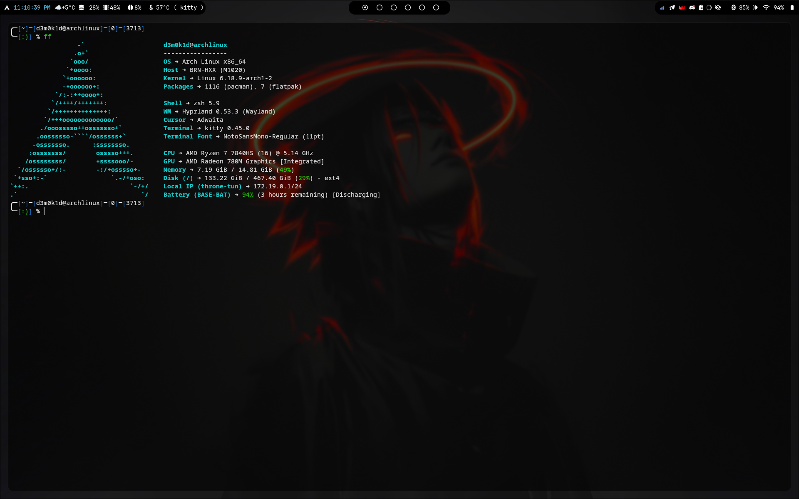
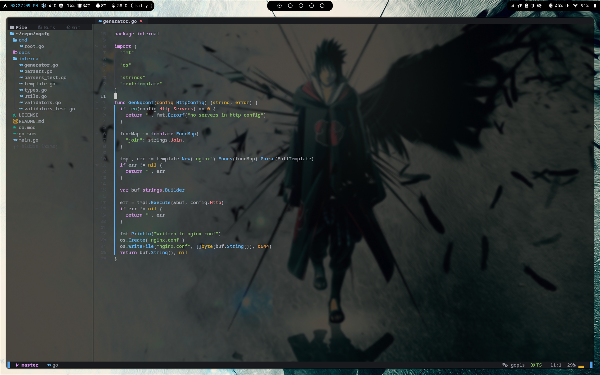

# dots

My personal simple setup for Hyprland on my Arch Linux

## Overview



## Core components
- Hyprland
- Waybar
- Wofi
- Hyprlock
- NeoVim + AstroNvim
- Kitty + OhMyZsh
- Hyprshot
- Fastfetch
- Lazygit
## Installation
I write simple makefile, but i dont test on new system. If you encounter any issues while using it, please create an issue on GitHub or contact me via email.
```shell
git clone https://github.com/d3m0k1d/dots.git
cd dots
sudo make backup
sudo make install
```
## License
This project is licensed under the MIT License.
